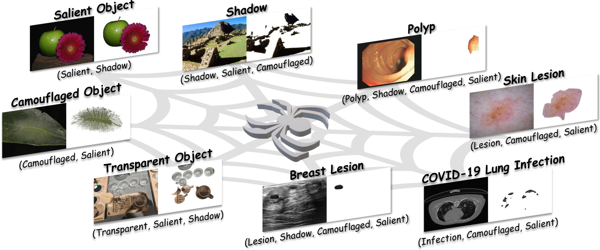
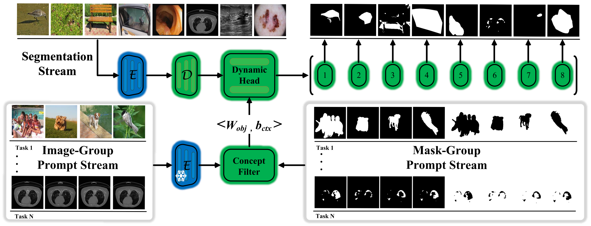
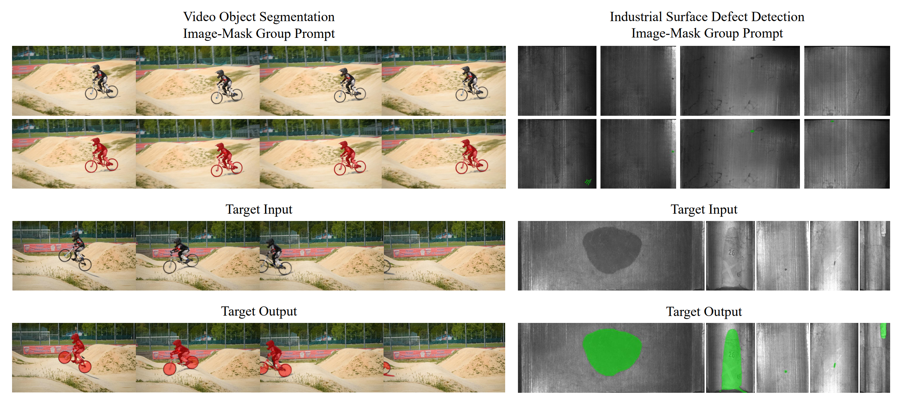

<br />
<p align="center">
  <h1 align="center">Spider: A Unified Framework for Context-dependent Concept Segmentation</h1>
  <p align="center">
    ICML, 2024
    <br />
    <a href="https://xiaoqi-zhao-dlut.github.io/"><strong>Xiaoqi Zhao*</strong></a>
    ·
    <a href="https://lartpang.github.io/"><strong>Youwei Pang*</strong></a>
    .
   <a href="https://jiwei0921.github.io/"><strong>Wei Ji*</strong></a>
    .
    <a ><strong>Baicheng Sheng</strong></a>
    .
     <a ><strong>Jiaming Zuo</strong></a>
    ·
    <a href="https://scholar.google.com/citations?hl=zh-CN&user=XGPdQbIAAAAJ"><strong>Lihe Zhang*</strong></a>
    ·
    <a href="https://scholar.google.com/citations?hl=zh-CN&user=D3nE0agAAAAJ"><strong>Huchuan Lu</strong></a>
  </p>

  <p align="center">
    <a href='https://arxiv.org/pdf/2405.01002'>
      
    </a>
  </p>
<br />

## Context-independent (CI) Concept vs. Context-dependent (CD) Concept
<p align="center">
     <br />
</p>

## CD Concept Segmentation Survey Paper
[(IJCV 2024) Towards Diverse Binary Segmentation via A Simple yet General Gated Network](https://arxiv.org/pdf/2303.10396)  


## Unified 8 CD Concept Segmentation Tasks
<p align="center">
     <br />
</p> 

## Spider: UniCDSeg Framework (You only train and infer once! 100% Unified Parameters.)
<p align="center">
     <br />
</p> 

## Performance
<p align="center">
     <br />
</p> 
<p align="center">
     <br />
</p> 
<p align="center">
     <br />
</p> 
<p align="center">
     <br />
</p> 

## Potential
### Continual/Zero-shot/Incremental Zero-shot learning
<p align="center">
     <br />
</p> 
<p align="center">
     <br />
</p> 

### In-Context Learning
<p align="center">
     <br />
</p> 

## Datasets 
<p align="center">
     <br />
</p> 

-  **DUTS (SOD)**: [Google Drive](https://drive.google.com/file/d/1S4V05HnVqYYkWCfoki_ALRy9E4AJYhhH/view?usp=sharing)  
-  **COD10K (COD)**: [Google Drive](https://drive.google.com/file/d/10_HwNAmsizkp-266f1tan-VIwNqkOkf9/view?usp=sharing)  
-  **SBU (SD)**: [Google Drive](https://drive.google.com/file/d/1SBUF6dF9aJlPzQGql_9lUSDwM8cN7IG-/view?usp=sharing)  
-  **Trans10K (TOS)**: [Trans10K Website](https://xieenze.github.io/projects/TransLAB/TransLAB.html)  
-  **Five datasets (CPS)**: [Google Drive](https://drive.google.com/file/d/1A29IkVysVPUPy4vu1RklKf4AAD7QvV3x/view?usp=sharing)  
-  **COVID-19 data (COD)**: [Google Drive](https://drive.google.com/file/d/1A29IkVysVPUPy4vu1RklKf4AAD7QvV3x/view?usp=sharing)  
-  **BUSI (BLS)**: [Google Drive](https://drive.google.com/file/d/1A29IkVysVPUPy4vu1RklKf4AAD7QvV3x/view?usp=sharing)  
-  **ISIC18 (SLS)**: [Google Drive](https://drive.google.com/file/d/1A29IkVysVPUPy4vu1RklKf4AAD7QvV3x/view?usp=sharing)
   
## Trained Models
-  Spider-ConvNext-B [Google Drive](https://drive.google.com/file/d/1AepdZrpQh0RvvWz784n1zEfkabZOsfKj/view?usp=sharing)
-  Spider-ConvNext-L [GitHub Release](https://github.com/Xiaoqi-Zhao-DLUT/Spider-UniCDSeg/releases/download/v1.0/Spider_convnext_l.pth)
-  Spider-Swin-B [Google Drive](https://drive.google.com/file/d/1AepdZrpQh0RvvWz784n1zEfkabZOsfKj/view?usp=sharing)
-  Spider-Swin-L [GitHub Release](https://github.com/Xiaoqi-Zhao-DLUT/Spider-UniCDSeg/releases/download/v1.0/Spider_swin_l.pth)

## Prediction Maps
-  Spider-Swin-B [Google Drive](https://drive.google.com/file/d/1dVtJ7as8NXpShGB4QExoooSLl5iGofJx/view?usp=sharing)
-  Spider-Swin-L [Google Drive](https://drive.google.com/file/d/1LcQEHjZap1XEmDT6_QOd6Fi3m9diPoHL/view?usp=sharing)
-  Spider-ConvNeXt-B [Google Drive](https://drive.google.com/file/d/1YJDpcPQk1cMANem0jD5yZpZftImzVwVX/view?usp=sharing)
-  Spider-ConvNeXt-L [Google Drive](https://drive.google.com/file/d/15zUFWKJNNQpNhjnhzlftsDLAXIVaZF8O/view?usp=sharing)

## Evaluation Tools

- <https://github.com/Xiaoqi-Zhao-DLUT/PySegMetric_EvalToolkit>
  
## To Do List

- [x] Release data sets.
- [x] Release model code.
- [x] Release model weights.
- [x] Release model prediction maps.


## Citation

If you think Spider-UniCDSeg codebase are useful for your research, please consider referring us:

```bibtex
@inproceedings{Spider,
  title={Spider: A Unified Framework for Context-dependent Concept Segmentation},
  author={Zhao, Xiaoqi and Pang, Youwei and Ji, Wei and Sheng, Baicheng and Zuo, Jiaming and Zhang, Lihe and Lu, Huchuan},
  booktitle={ICML},
  year={2024}
```
